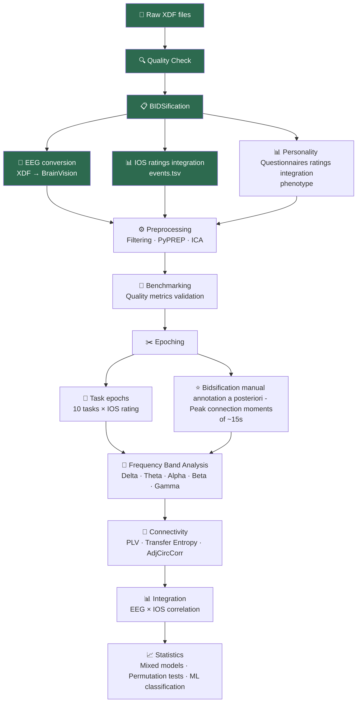

# 🧠 Interpersonal Synchrony in Autism: Bidsification of multimodal data !

<a href="https://github.com/anna-monnier">
  
   <b>anna-monnier</b>
</a>

### Short bio: a "Generative Neurophenomenology" PhD !

I am a PhD student in Psychiatric Sciences at Université de Montréal - CHU Sainte-Justine !
My work is at the intersection of conscious phenomena & psychiatry and my methods of investigation:
- EEG & ECG hyperscanning, 
- Social neuroscience, 
- and Phenomenology (subjective, first-person methods). 

This practice is called Generative Neurophenomenology [1]

## Introduction

| A multimodal project | EEG + ECG Hyperscanning data, videos + various forms of subjective experience (likert scales and more qualitative data)|
|------|-----|
| Analyses | Examining 🧠 **interpersonal synchrony** in relation with the felt experience of 👥 **Togetherness** (feeling one with a partner) ! |
| Cohorte | in **80 dyads**, mother-child pairs, autistic and non-autistic |

--> The project presents **a critical need for bidsification !!!**

📄 [Project poster](docs/Poster.pdf)

---

## 2 Goals for brainhack school 2026

> 🎯 Main goal: becoming autonomous in analysing and adapting my lab's pipelines to my data — and exploring the potential of visualizations!

1. **PERSONAL GOAL** = **To explore** inter-brain synchrony patterns between mothers and child (autistic or non-autistic) of the pilot **EEG data** (9 dyads)
I want to to check if their neural dynamics relate to the subjective experience they reported. — So, also in correlation with likert scales.
For this mission, the pipeline I am going to adapt to my data is not shared yet with the world, and comes from my [PPSP lab](https://github.com/ppsp-team)

3. **SHARED GOAL** = **To produce a bidsfication Notebook** for hyperscanning + annotations of subjective data (that can be useful for researcher practicing neurophenomenology and hyperscanning)

---

## Data

Data collected under approved ethics protocols; raw data not publicly shared

The protocole follows 10 tasks

| Duration | Task |
|----------|------|
| 1 min | ⬜ 👁️ Eyes open |
| 1 min | ⬜ 🙈 Eyes closed |
| 2 min | 🟦 🤚 **Spontaneous imitation** |
| 2 min | 🟩 🗣️ **Day planning** |
| 1 min | ⬜ 👁️ Eyes open |
| 1 min | ⬜ 🙈 Eyes closed |
| 2 min | 🟩 🗣️ **Day planning** |
| 2 min | 🟦 🤚 **Spontaneous imitation** |
| 1 min | ⬜ 👁️ Eyes open |
| 1 min | ⬜ 🙈 Eyes closed |

- **Participants**: 9 pilot dyads (autistic and non-autistic child + mother)
- **EEG**: Dual 128 EGI HydroCel system (high density hyperscanning), continuous recording during the 10 tasks for LSL (LabRecorder) producing an xdf.
- **Subjective measure**: Inclusion of the Other in the Self scale (IOS, 1–7 Likert) after each of the 10 tasks (.tsv)

### Pipeline overview

---

## Deliverables

1. ⬜ Jupyter Notebook going through bidsification process and a posteriori annotations for hyperscanning folks

For the goal of personal exploration goal:

1. ⬜ Adapted EEG preprocessing pipeline for my pilot (not shared)
2. ⬜ Inter-brain connectivity analysis (PLV, transfer entropy) for 9 pilot dyads
3. ⬜ Statistical comparison of inter-brain synchrony between groups (autistic/non-autistic dyads) and across the 10 tasks
4. ⬜ Correlation between task-averaged inter-brain synchrony and IOS ratings per task

---

## Skills, Tools & Methods

| Status | Skill | Tools |
|--------|-------|-------|
| ✅ | **Agentic coding** — using AI to assist pipeline adaptation | `Claude Code` |
| ✅ | **Git & GitHub workflows** — branching, pull requests, reproducible science | `Git / GitHub` |
| ⬜ | **Pipeline adaptation** — adapting the SCAALE hyperscanning pipeline to my pilot dataset | [ppsp-hyperscanning-pipeline](https://github.com/ppsp-team/ppsp-hyperscanning-pipeline) |
| ⬜ | **BIDSification** — phenotype annotations, a posteriori BIDS annotations | `MNE-BIDS` · `PyBIDS` · `PyXDF` |
| ⬜ | **EEG preprocessing** — filtering, bad channels, ICA, line noise removal | `MNE-Python` · `PyPREP` · `AutoReject` · `ICALabel` · `Zapline+` |
| ⬜ | **Hyperscanning connectivity** — PLV, wPLI, transfer entropy, AdjCircCorr | [HyPyP](https://github.com/ppsp-team/HyPyP) |
| ⬜ | **Statistics for small datasets** — mixed models, permutation tests | `pandas` · `numpy` · `scikit-learn` |
| ⬜ | **Data visualization** — connectivity maps, topographies, synchrony plots | `matplotlib` · `seaborn` |

---

## Visualization

When arrived at that stage, the next challenge of my project is to move from average data analysis per task (tasks of 1 or 2 minutes) to identify / vizualise the dynamics of the synchronisation (choice of metrics, directionality, switches, metastability, evolution of regimes of synchrony...)
   
---

## References and acknowledgements

This work is part of a CIHR-funded project (2024–2028)

- *reference list to be completed*
[1] Monnier, A., Adel, L., & Dumas, G. (2025). [Now is the time: operationalizing generative neurophenomenology through interpersonal methods](https://academic.oup.com/nc/article/2025/1/niaf052/8405712). *Neuroscience of Consciousness*, 2025(1), niaf052.
