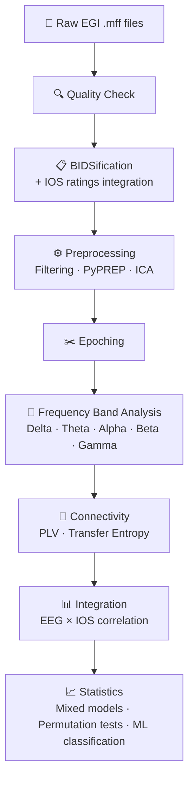

# 🧠 Inter-Brain Synchrony in Autism: A Hyperscanning EEG Study

<a href="https://github.com/anna-monnier">
  
   <b>anna-monnier</b>
</a>

### Short bio: When neurophenomenology meets social neuroscience

I am a PhD student in Psychiatric Sciences at Université de Montréal, at CHU Sainte-Justine !
My work is at the intersection of 
- EEG hyperscanning, 
- Social neuroscience, 
- and Phenomenology (subjective, first-person methods). 

## Introduction

This is the **first analytical step** of a larger study examining interpersonal synchrony in autism in **80 autistic/non-autistic dyads** (child-mother pairs) that are currently recorded across **three modalities: EEG, ECG, and movement kinematics**. 

Here, we focus only on **EEG hyperscanning** — (simultaneous dual-brain recordings) during spontaneous cooperative tasks in a dyad and resting states tasks. 
The goal is to characterize inter-brain synchrony patterns between mothers and child (autistic or non-autistic), and to relate these neural dynamics to subjective experience.

📄 [Project poster](docs/Poster.pdf)

---

## Objectives

During this Brainhack, I aim to:

1. Adapt in a dedicated Branch and run the [PPSP hyperscanning EEG pipeline](https://github.com/ppsp-team/ppsp-hyperscanning-pipeline) on our pilot dataset (9 dyads)
2. Bidsify the data
3. Implement robust EEG preprocessing using a PyPREP-based approach for automated bad channel and artefacts detection
4. Compute inter-brain connectivity metrics (Phase-Locking Value, transfer entropy...) for each of the 10 tasks
5. Relate EEG connectivity to IOS subjective ratings
6. Run group statistics between autistic and non-autistic group
TBC. Build a reproducible, documented pipeline ready to scale to 80 dyads

---

## Data

- **Participants**: 9 pilot dyads (autistic and non-autistic child + mother)
- **EEG**: Dual EGI HydroCel system (hyperscanning), continuous recording during 10 tasks (resting states and cooperative tasks)
- **Subjective measure**: Inclusion of the Other in the Self scale (IOS, 1–7 Likert) / task
- **Clinical Not open data**: Data collected under approved ethics protocols; raw data not publicly shared

---

## Tools & Methods (the pipelines used and produced in my lab are not public yet)

The pipeline is built on **Bash, VSCode, Python and MNE-Python** as its foundation, and developed with the assistance of **Claude Code** for pipeline adaptation and documentation.

| Tool | Use |
|------|-----|
| `MNE-Python` | EEG preprocessing, filtering, ICA, connectivity |
| [ppsp-hyperscanning-pipeline](https://github.com/ppsp-team/ppsp-hyperscanning-pipeline) | Main hyperscanning pipeline (adapted for our dataset) |
| `PyPREP` | Automated bad channel detection and interpolation |
| `Claude Code` | Agentic pipeline development and adaptation |
| `pandas` / `numpy` | Data handling and manipulation |
| `scikit-learn` | Machine learning (group classification) |
| `matplotlib` / `seaborn` | Visualization |
| `Git / GitHub` | Version control and reproducibility |

### Pipeline overview

---

## Deliverables

1. ✅ Adapted EEG preprocessing pipeline for our EGI dataset
2. ✅ Inter-brain connectivity analysis (PLV, transfer entropy) for 9 pilot dyads
3. ✅ Correlation between (avergaed!) neural synchrony and IOS subjective ratings per task
4. ✅ Documented, reproducible GitHub repository

---

## Visualization

The challenge of my project is to start with average data per tasks (tasks of 1 or 2 minutes) to a relevant choice of metrics and a vizualisation of the dynamics of the synchronisation (directionality, switches, metastability, evolution of regimes of synchrony...)

*Coming soon — inter-brain connectivity maps, PLV topographies, IOS correlation plots*

---

## Skills I Want to Learn

- Becoming autonomous in analysing and adapting the pipelines of my lab to my data !!!
- Exploring the potentiality of vizualisation and

1. **EEG preprocessing in Python** — MNE-Python, ICA, PyPREP bad channel detection
2. **Hyperscanning connectivity analysis** — PLV, wPLI, transfer entropy, Adjusted CirrCorr
3. **Agentic coding with Claude Code** — using AI to assist pipeline adaptation
4. **Git & GitHub workflows** — branching, pull requests, reproducible science
5. **Machine learning for small neuroimaging datasets** — cross-validation, LOOCV

---

## References and acknowledgements

This work is part of a CIHR-funded project (2024–2028)

- *reference list to be completed*