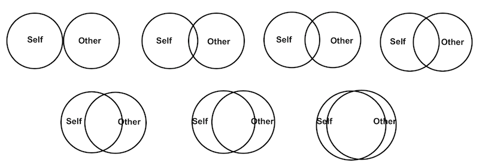
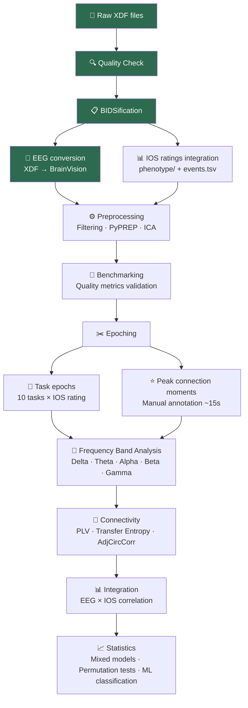

# 🧠 Inter-Brain Synchrony in Autism: A Hyperscanning EEG Study

<a href="https://github.com/anna-monnier">
  
   <b>anna-monnier</b>
</a>

### Short bio: a "generative neurophenomenology" PhD !

I am a PhD student in Psychiatric Sciences at Université de Montréal - CHU Sainte-Justine !
My work is at the intersection of conscious phenomena & psychiatry and my methods of investigation:
- EEG & ECG hyperscanning, 
- Social neuroscience, 
- and Phenomenology (subjective, first-person methods). 

This practice is called Generative Neurophenomenology [1]

## Introduction

A multimodal project examining 🧠 **interpersonal synchrony** in **80 dyads** (mother-child pairs, autistic and non-autistic) 
in relation with the felt experience of 👥 **Togetherness** (feeling one with a partner) !

The large project includes EEG + ECG Hyperscanning data, videos + various forms of subjective experience (likert scales and more qualitative data)

📄 [Project poster](docs/Poster.pdf)

---

## 2 Goal for brainhack school / and tools and Methods

1. **PERSONAL GOAL** = **To explore** inter-brain synchrony patterns between mothers and child (autistic or non-autistic) of the pilot **EEG data** (9 dyads)
I want to to check if their neural dynamics relate to the subjective experience they reported. — So, also in correlation with likert scales.
For this mission, the pipeline I am going to adapt to my data is not shared yet with the world, and comes from my [PPSP lab](https://github.com/ppsp-team)

3. **SHARED GOAL** = **To produce a bidsfication pipeline** for hyperscanning + annotations of subjective data (that can be useful for researcher practicing neurophenomenology and hyperscanning)

| Tool | Use |
|------|-----|
| `Git / GitHub` | Version control and reproducibility |
| `Claude Code` | Agentic pipeline development and adaptation |

| `MNE-Python` | EEG preprocessing, filtering, ICA, connectivity |
| `MNE-BIDS` | EEG to BIDS conversion |
| `PyXDF` | XDF file reading |
| `PyPREP` | Automated bad channel detection and interpolation |
| `AutoReject` | Automated epoch rejection based on peak-to-peak amplitude |
| `ICALabel` | Automated ICA component classification (brain vs artifact) |
| `Zapline+` | Line noise removal (60Hz) |
| [HyPyP](https://github.com/ppsp-team/HyPyP) | Hyperscanning connectivity analysis (PLV, transfer entropy) |
| `pandas` / `numpy` | Data handling and manipulation |
| `matplotlib` / `seaborn` | Visualization |
| `scikit-learn` | Machine learning (group classification) |

---

## Data

Data collected under approved ethics protocols; raw data not publicly shared

The protocole follows 10 tasks

| 1 min | 1 min | 2 min | 2 min | 1 min | 1 min | 2 min | 2 min | 1 min | 1 min |
|-------|-------|-------|-------|-------|-------|-------|-------|-------|-------|
| 👁️ Yeux ouverts |  🙈  Yeux fermés | 🤚 **Imitation spontanée** | 🗣️  **Planification journée** | 👁️ Yeux ouverts |  🙈  Yeux fermés | 🗣️  **Planification journée** | 🤚 **Imitation spontanée** | 👁️ Yeux ouverts | 👁️ Yeux fermés |

- **Participants**: 9 pilot dyads (autistic and non-autistic child + mother)
- **EEG**: Dual 128 EGI HydroCel system (high density hyperscanning), continuous recording during the 10 tasks for LSL (LabRecorder) producing an xdf.
- **Subjective measure**: Inclusion of the Other in the Self scale (IOS, 1–7 Likert) after each of the 10 tasks (.tsv)

### Pipeline overview

---

## Deliverables

1. ⬜ Jupyter Notebook going through bidsification and annotation with for hyperscanning folks

For the goal of exploration:

1. ⬜ Adapted EEG preprocessing pipeline for my pilot (not shared)
2. ⬜ Inter-brain connectivity analysis (PLV, transfer entropy) for 9 pilot dyads
3. ⬜ Statistical comparison of inter-brain synchrony between groups (autistic/non-autistic dyads) and across the 10 tasks
4. ⬜ Correlation between task-averaged inter-brain synchrony and IOS ratings per task

---

## Visualization

The challenge of my project is to start with average data per tasks (tasks of 1 or 2 minutes) to a relevant choice of metrics and a vizualisation of the dynamics of the synchronisation (directionality, switches, metastability, evolution of regimes of synchrony...)

---

## Skills I Want to Learn

- Becoming autonomous in analysing and adapting the pipelines of my lab to my data !!!
- Exploring the potentiality of vizualisations

1. ⬜ **Agentic coding with Claude Code** — using AI to assist pipeline adaptation
2. ⬜ **Git & GitHub workflows** — branching, pull requests, reproducible science

1. ⬜ **EEG preprocessing in Python** — MNE-Python, PyPREP ...
2. ⬜ **Hyperscanning connectivity metrics** — PLV, wPLI, transfer entropy, Adjusted CirrCorr

1. ⬜ **Statistics for small neuroimaging datasets** — mixed models, permutation tests, LOOCV
2. ⬜ **Data visualization** — connectivity maps, topographies, inter-brain synchrony plots
---

## References and acknowledgements

This work is part of a CIHR-funded project (2024–2028)

- *reference list to be completed*
[1] Monnier, A., Adel, L., & Dumas, G. (2025). [Now is the time: operationalizing generative neurophenomenology through interpersonal methods](https://academic.oup.com/nc/article/2025/1/niaf052/8405712). *Neuroscience of Consciousness*, 2025(1), niaf052.
